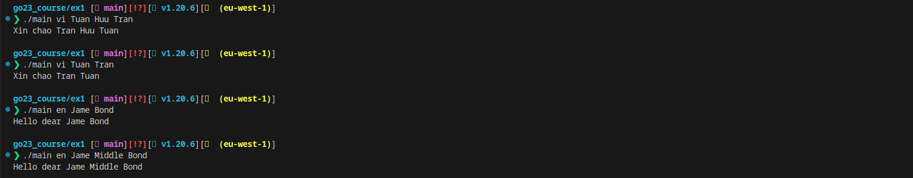

# go23_course
## Excercise one
Simple greeting CLI, can convert English name to English/Vietnamese name

## Usage 
```sh
./main <language> <first_name> <middle_name> <last_name>
or ./main <language> <first_name> <last_name>
```

## Sample Usage
```sh
./main vi Tuan Huu Tran
```
Output: Xin chao Tran Huu Tuan

```sh
./main en Jame Bond
```
Output: Hello dear Jame Bond

## Result
