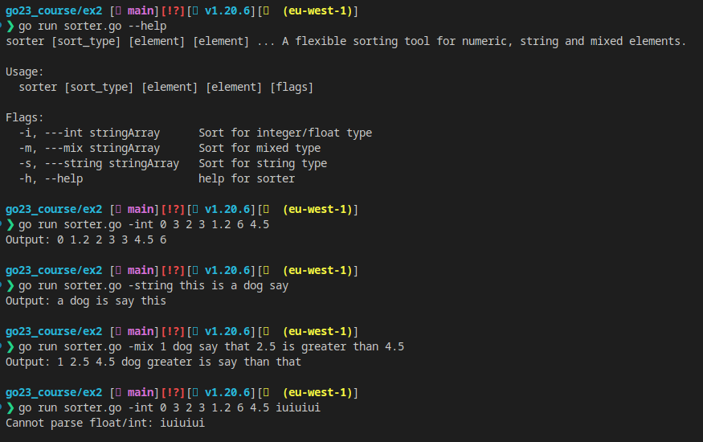

# go23_course
## Excercise 2
Simple sorter CLI, can use for sorting element with type Integer, Float, String or mixed type

## Usage 
Using this command to get further usage
```sh
./soter --help
```
It will show you the guideline how to use the command


## Sample Usage
```sh
./sorter int 0 3 2 3 1.2 6 4.5
```
Output: `Output: 0 1.2 2 3 3 4.5 6`

```sh
./sorter string this is a dog say
```
Output: `Output: a dog is say this`

```sh
./sorter mix 1 dog say that 2.5 is greater than 4.5

```
Output: `Output: 1 2.5 4.5 dog greater is say than that`

```sh
./sorter mix --desc 1 dog say that 2.5 is greater than 4.5
```
Output: `Output: 4.5 2.5 1 that than say is greater dog`

## Result
